# Bloom UI

Reusable React Native components for Bloom, a cross-platform mobile app for iOS and Android that helps users track plant watering schedules and get reminders based on each plant's care needs.

## What Was Implemented

The project extracts repeated design elements into modular React Native components. Each component lives in its own folder/file and is driven by props for dynamic content.

Key implemented components:

| Component | Path | Purpose |
| --- | --- | --- |
| `Button` | `src/components/ui/Button` | Primary/secondary buttons, icon-only actions, loading and disabled states |
| `Input` | `src/components/ui/Input` | Text, email, password and number inputs with label, icon, error and disabled states |
| `PlantCard` | `src/components/ui/PlantCard` | Image card with optional badge or date pill |
| `PhotoGrid` | `src/components/ui/PhotoGrid` | Adaptive image grid using `useWindowDimensions` and stable item keys |
| `NavBar` | `src/components/ui/NavBar` | Bottom segmented navigation with active state and badge support |
| `Badge` / `BadgePill` | `src/components/ui/Badge`, `src/components/ui/BadgePill` | Circular icon badges, count badges and compact date pills |
| `TopActions` | `src/components/ui/TopActions` | Header action controls with reusable glass-button surface |
| `WateringSchedule` / `WateringSlider` | `src/features/watering/components` | Reusable watering workflow controls |
| `SettingsPanel` / `SettingsRow` | `src/features/settings/components` | Settings rows, editable fields and action rows |
| `PlantDetail` | `src/features/plants/components/PlantDetail` | Responsive plant detail block with image and truncated description |

## Technical Requirements Covered

- **React Native base components:** `View`, `Text`, `Image`, `ScrollView`, `TextInput`, `TouchableOpacity`, `Pressable`, `Modal`.
- **Styling:** all component styles use `StyleSheet.create()`.
- **Flexbox layout:** components use `flexDirection`, `justifyContent`, `alignItems`, `gap`, wrapping and flexible sizing.
- **Adaptivity:** `PhotoGrid`, `WateringSlider`, `PlantDetail` and screens use `useWindowDimensions` for responsive sizing.
- **Platform handling:** `GlassView` uses `Platform.OS` to render native blur on iOS and a composed fallback/tint layer on Android.
- **Props:** labels, icons, image sources, badge data, values and callbacks are passed through props.
- **Modularity:** UI, brand, watering, settings and plant-detail components are separated into dedicated files.
- **Code cleanliness:** shared colors, sizes, spacing, typography and gradients are centralized in `src/theme`; repeated glass-button behavior is extracted into `GlassButtonSurface`.

## Component Screenshots

Screenshots were captured from Storybook on the iOS Simulator. This section covers every component from `src/components/ui`, then the plant/settings/watering feature components requested for submission.

### UI Components

| Component | Screenshot |
| --- | --- |
| AlertModal | 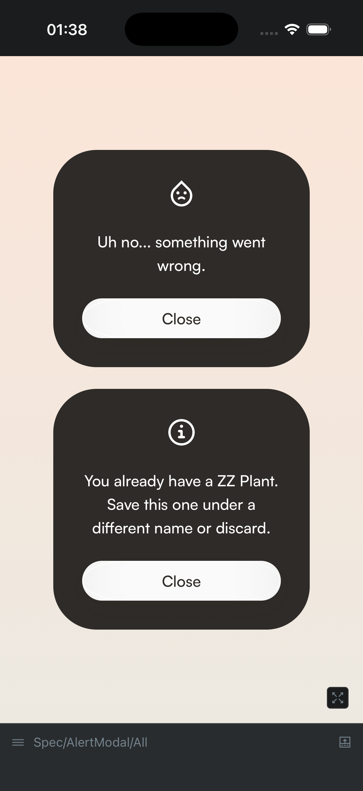 |
| AppText | 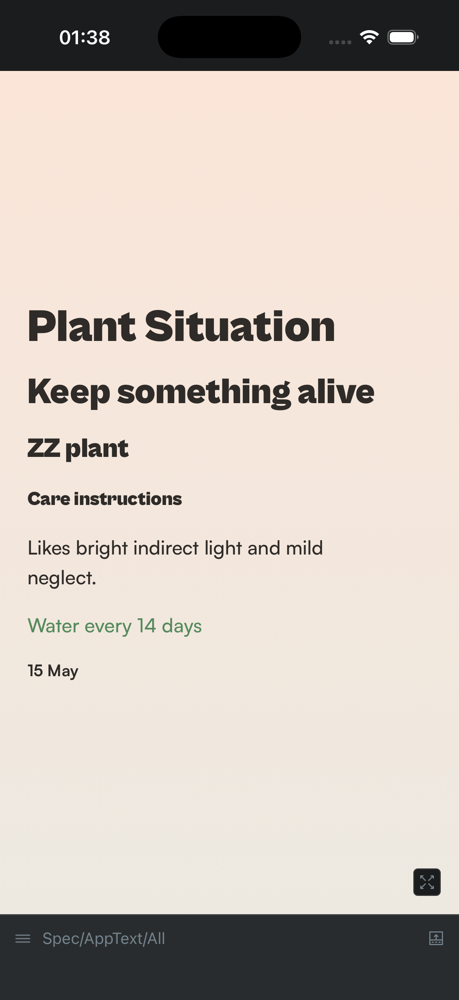 |
| Badge | 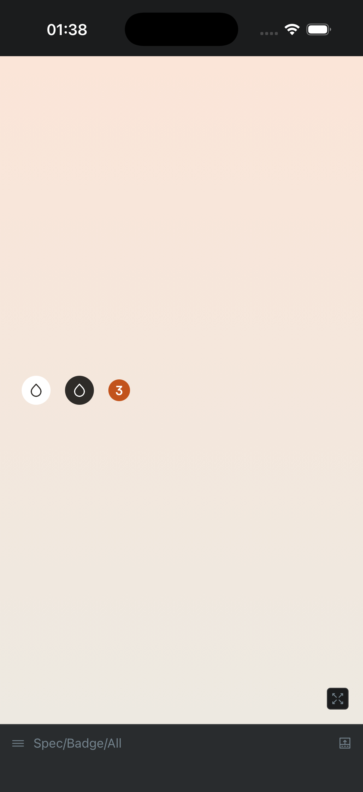 |
| BadgePill | 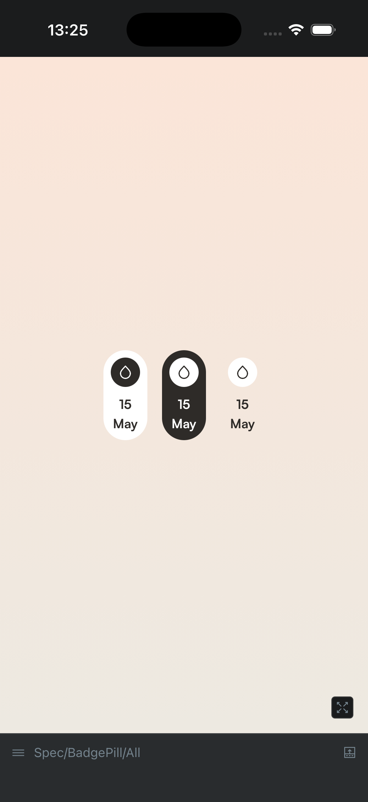 |
| BottomActions | 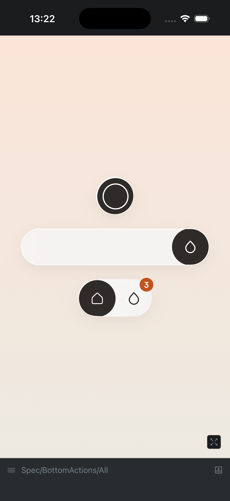 |
| Button | 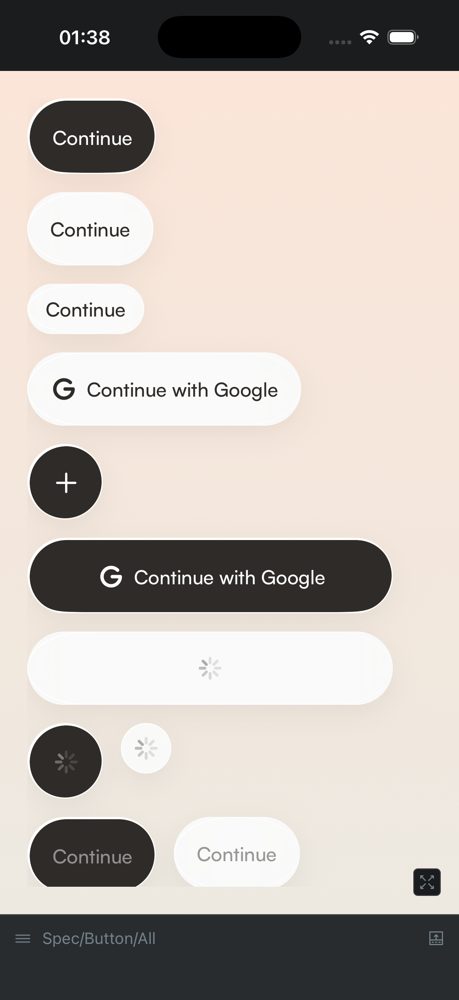 |
| EditableTitle | 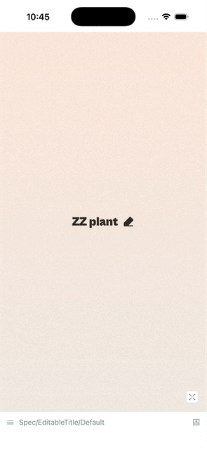 |
| Icon | 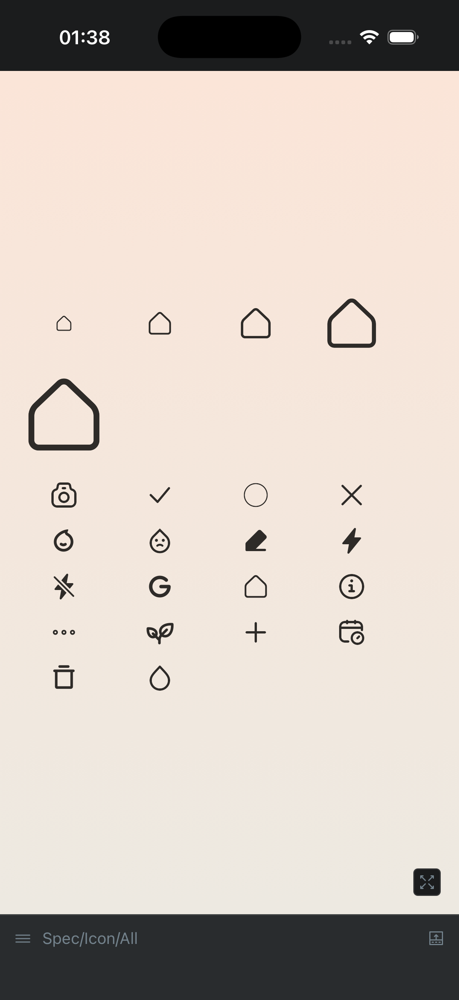 |
| Input | 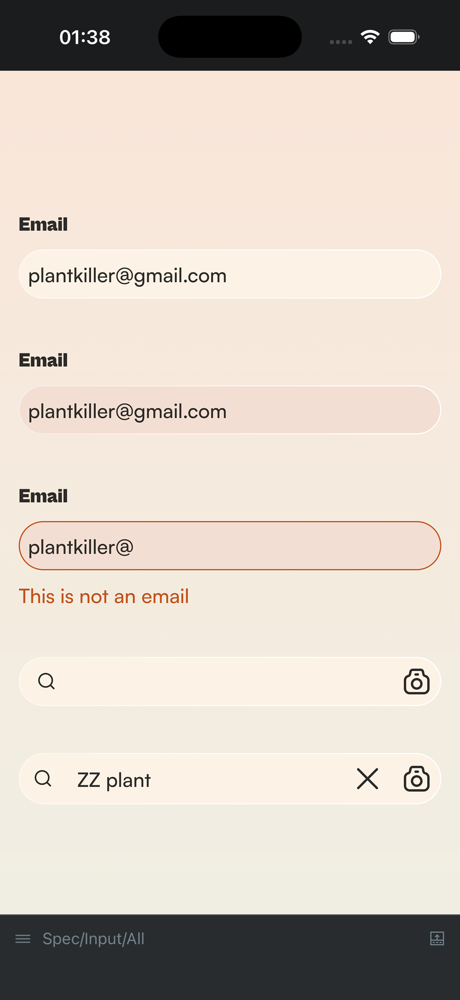 |
| Loader | 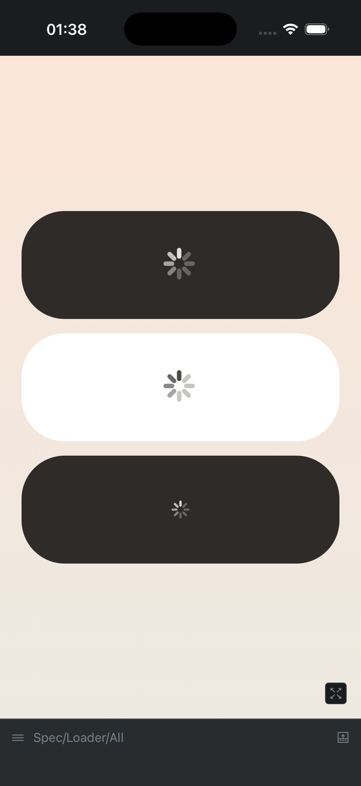 |
| NavBar | 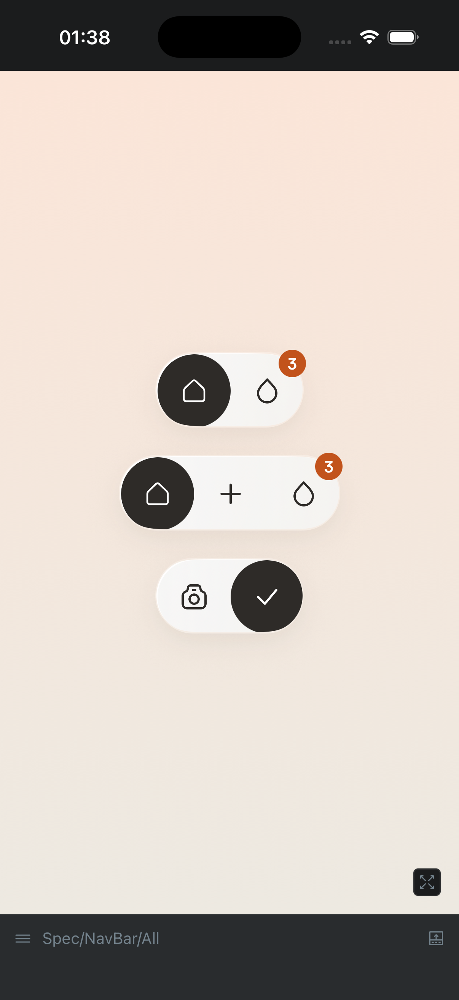 |
| PhotoGrid | 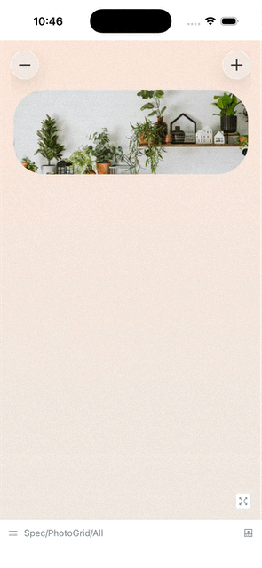 |
| PlantCard | 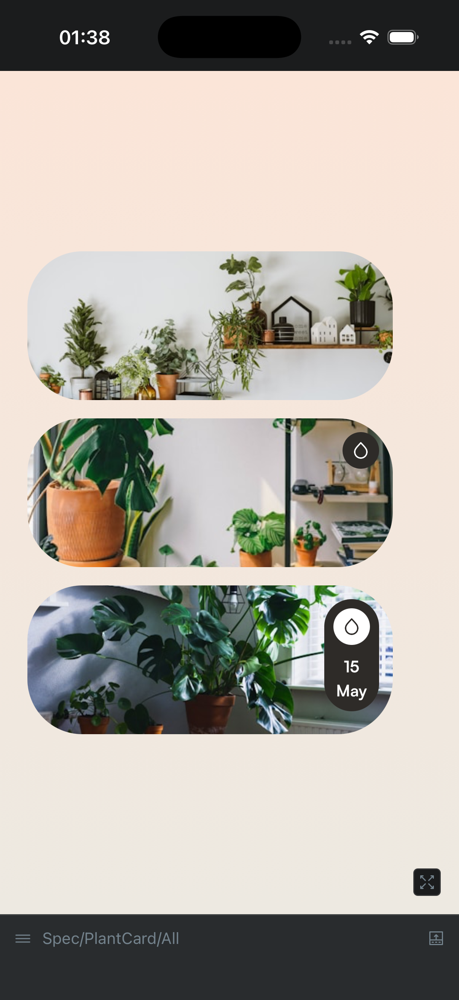 |
| TopActions | 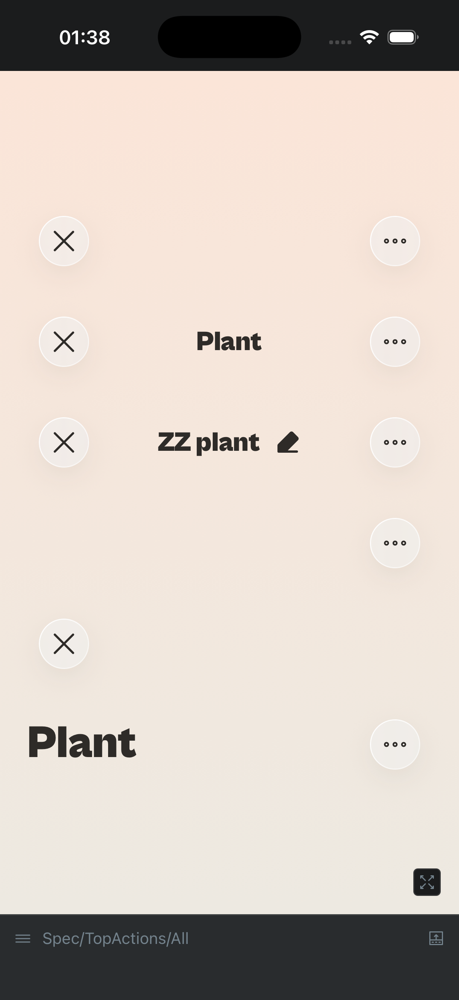 |

### Feature Components

| Component | Screenshot |
| --- | --- |
| PlantDetail | 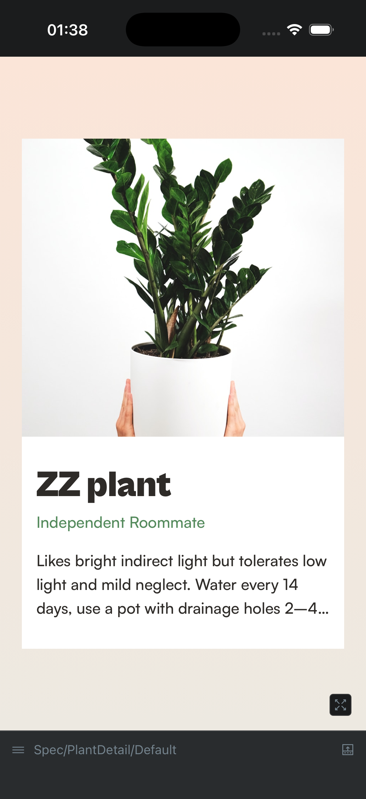 |
| SettingsPanel | 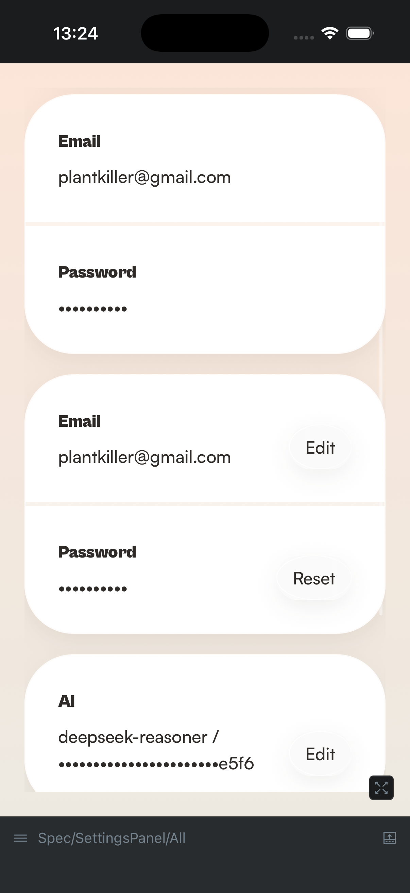 |
| WateringCard |  |
| WateringSchedule |  |
| WateringSlider | 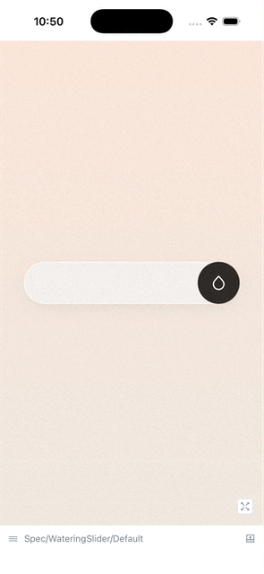 |

## Running The Project

Install dependencies:

```sh
npm install
```

Start the component Storybook:

```sh
npm run storybook:start
```

Run Storybook on iOS:

```sh
npm run storybook:ios
```

Run Storybook on Android:

```sh
npm run storybook:android
```

Run tests:

```sh
npm test -- --watch=false
```

Run TypeScript check:

```sh
npx tsc --noEmit
```

Run ESLint:

```sh
npm run lint
```
